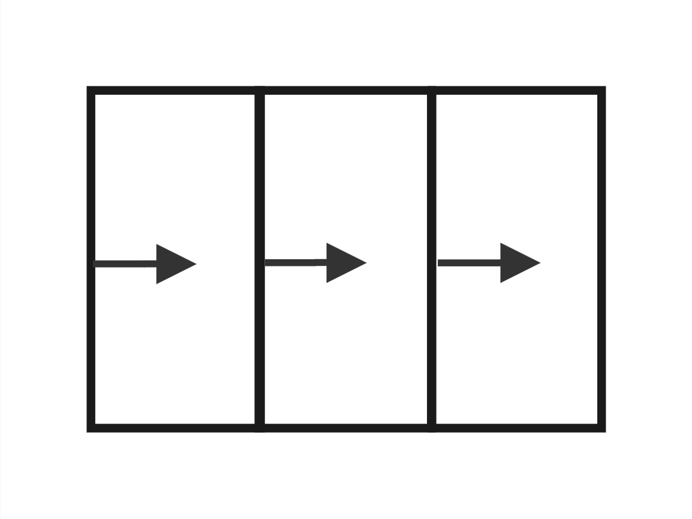
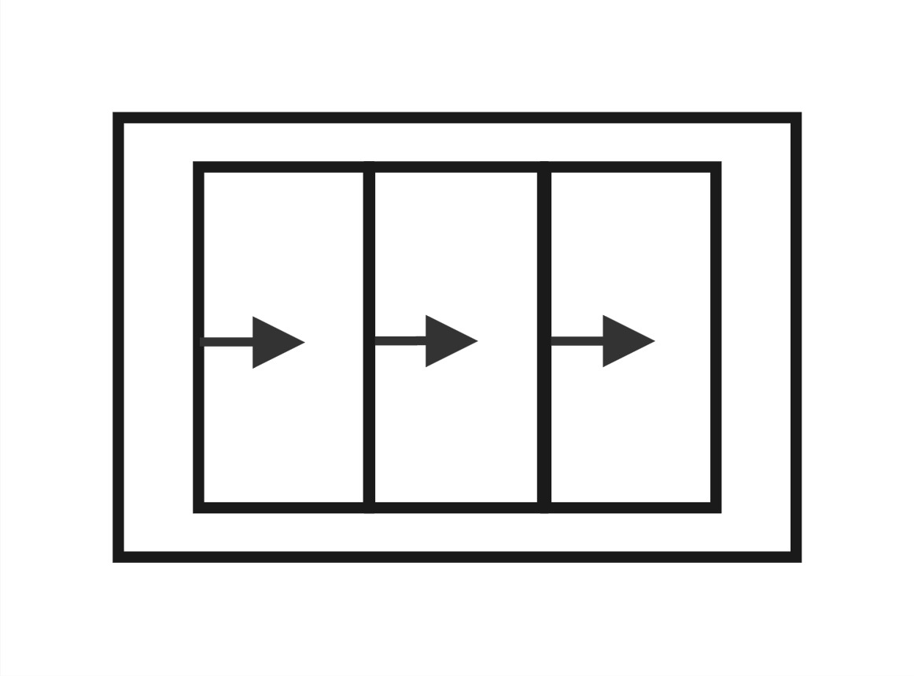
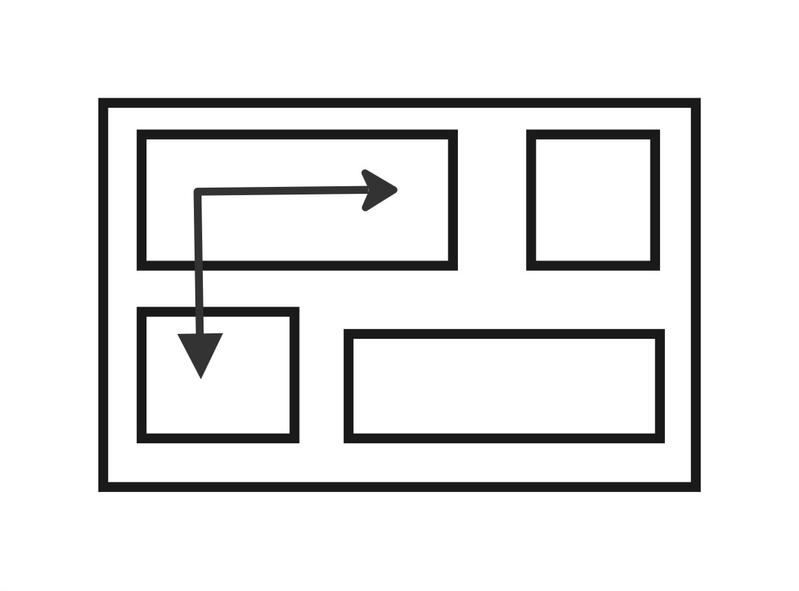

# Archtect Mindset

[](http://getbem.com/)
[](https://sass-guidelin.es/#the-7-1-pattern) [](https://www.w3schools.com/html/html_responsive.asp) [](https://www.invisionapp.com/inside-design/what-is-component-driven-design/)

## Design Responsivo

### Princípios básicos da responsividade
#### Fluid Layouts
- Habilita a webpage a se adaptar a largura ou também altura da janela de exibição
- Usa as unidades vh vw ao invés de px para elementos que devem dse adaptar a viewport (usualmento layouts)
- Usa max-width no lugar de width

#### Responsive Units
- Usa unidade rem ao invés de px para a maior parte das larguras dos elementos para facilitar o escalonamento de um layout completo

#### flexible images
- por padrão imagens não escalam automatimente quando mudamos a janela de exibição então deve-se ajustar isso.
- sempre usar % para dimencionar imagens junto com a propriedade max-width

#### Media Queries
- Usar midia queries para mudar os estilos css em certas larguras da janela de exibição (chamado de breackpoints)

### Layouts Types

#### Float Layouts
Esse projeto utiliza float layouts



#### Flexbox
Projeto com flexbox será desenvolvido e seu link em breve estará diponível aqui! 


#### CSS GRID
Projeto com CSS Grid será desenvolvido e seu link em breve estará diponível aqui! 


## Código escalável e com alta manuteinibilidade

- Limpo
- Modular
- Reusável
- Pronto para Crescer

### Pense -> construa -> arquitete 

#### Pense

Pense como o layout da página ou do aplicação antes de escrever um código.

##### Aplicação de Component-Driven Design no CSS

- blocos de construção modular para criar interfaces. Juntos criam o layout da página.
- caracteristica principal é ser reutilizavel em todo o projeto e entre diferentes projetos.
- Não menos importante os componêntes devem ser independentes entre si.

#### Construa

Vonstrua o layout em HTML e CSS com uma estrutura consistente para nomear classes.

- Block Element Modifier BEM

O padrão BEM (Block Element Modifier) é uma metodologia de nomenclatura para classes CSS que ajuda a organizar e estruturar o código CSS de forma mais modular e escalável. Aqui está uma breve explicação de cada parte do padrão:

```cs
.block {}
.block__element {}
.block__element--modifier {}
```

#### Arquitete

Crie uma arquitetura lógica para seu CSS com arquivos e pastas.

##### 7-1 pattern

7 pastas diferentes para  sass e um arquivo sass principal para importar todos os outros arquivos e compilá-los para um css stylesheet

As 7 pastas

- base/
- components/
- layout/
- pages/
- themes/
- abstracts/
- vendors/
